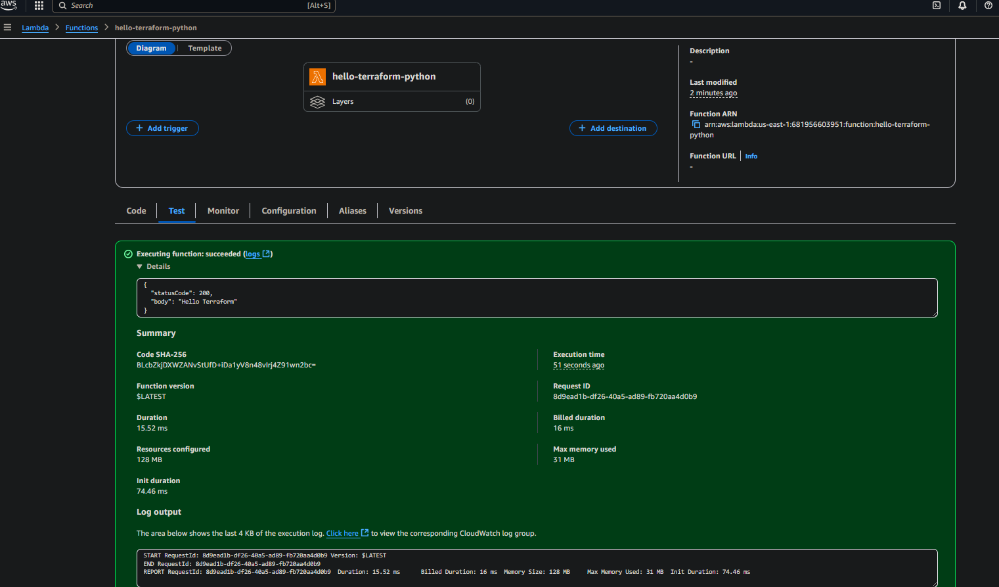
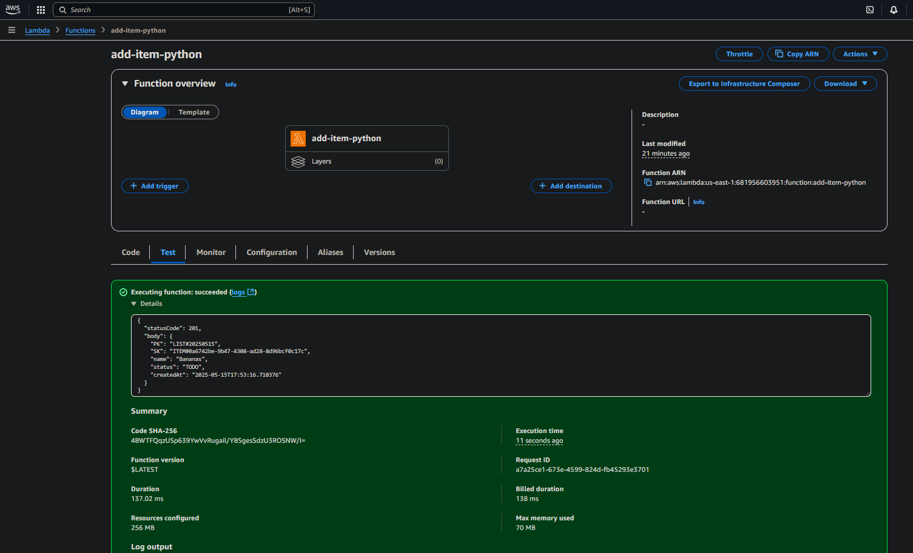
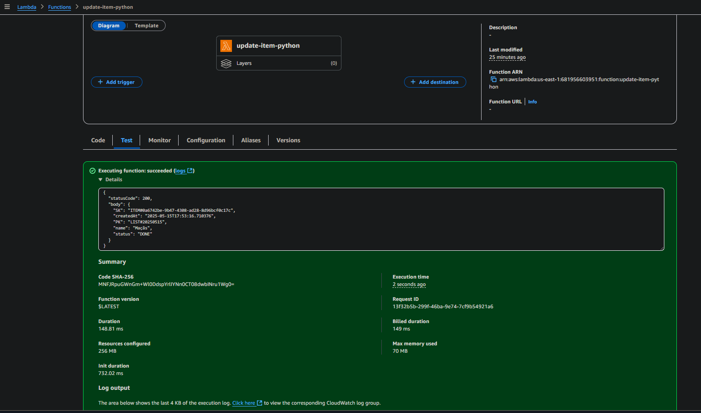
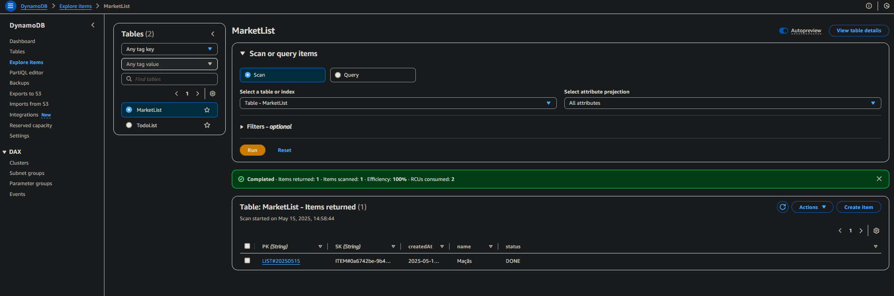
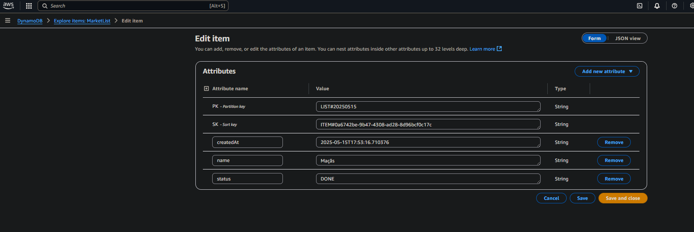
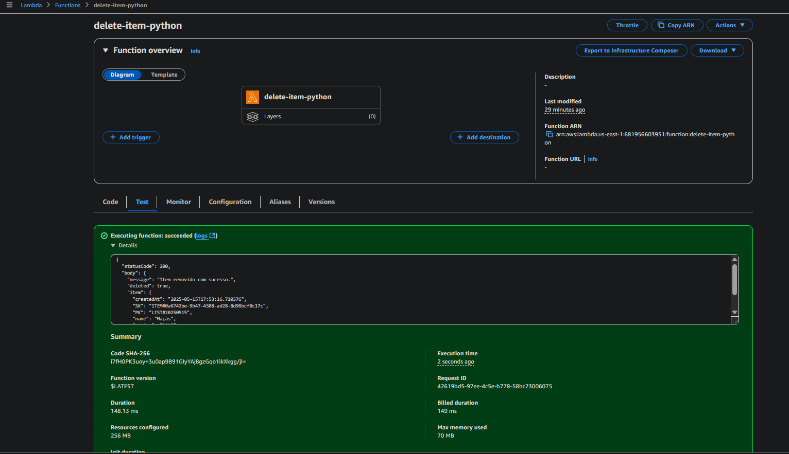
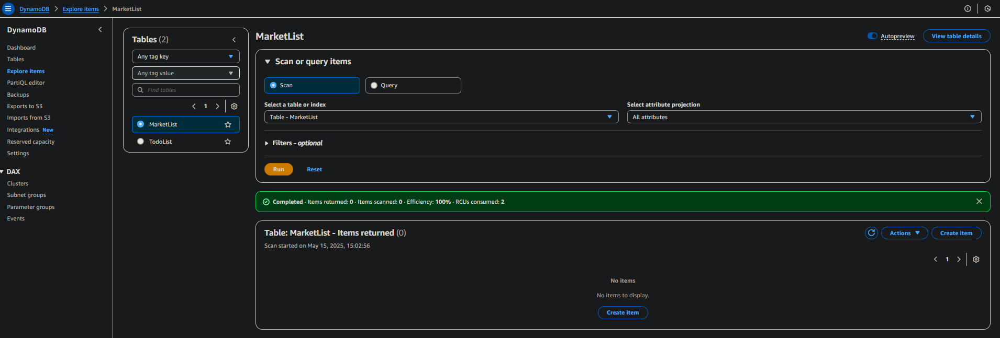

# 🛒 Market List com Terraform, AWS Lambda e Python

Este projeto tem como objetivo criar uma aplicação serverless  para gerenciamento de uma lista de compras, utilizando **AWS Lambda**, **DynamoDB**, **Terraform** e **Python**. Ele demonstra como construir, empacotar e implantar múltiplas funções Lambda organizadas, de forma automatizada com infraestrutura como código.

---

## ⚙️ Funcionalidades Disponíveis

* **Hello Terraform**: Retorna uma mensagem simples

* **Add Item**: Adiciona um item à lista de compras

* **Update Item**: Atualiza o nome ou status de um item

* **Delete Item**: Remove um item da lista de compras

---

## 📸 Demonstrações Visuais

### ✅ Hello Terraform



### ➕ Adicionando um item à lista



### 🔄 Atualizando um item da lista



### 🗃️ DynamoDB




### ❌ Deletando um item da lista



### 📉 DynamoDB após exclusão do item



---

## 📁 Estrutura do Projeto

```plaintext
meu_projeto/
├── .venv/                      # Ambiente virtual Python
├── dist/                       # Arquivos zip das funções Lambda empacotadas
│   ├── add_item_lambda.zip
│   ├── delete_item_lambda.zip
│   ├── hello_terraform_lambda.zip
│   └── update_item_lambda.zip
├── requirements.txt            # Dependências da aplicação
├── requirements-dev.txt        # Dependências para desenvolvimento e testes
├── scripts/
│   └── build.py                # Script de empacotamento das Lambdas
├── src/
│   ├── common/                 # Código compartilhado entre funções (em breve)
│   └── lambdas/                # Funções Lambda organizadas por responsabilidade
│       ├── add_item/
│       │   └── lambda_function.py
│       ├── delete_item/
│       │   └── lambda_function.py
│       ├── hello_terraform/
│       │   └── lambda_function.py
│       └── update_item/
│           └── lambda_function.py
├── tests/
│   └── test_lambdas/           # Testes automatizados das funções Lambda
├── terraform/                  # Código Terraform para infraestrutura na AWS
│   ├── dynamodb.tf
│   ├── iam.tf
│   ├── main.tf
│   ├── outputs.tf
│   ├── providers.tf
│   ├── variables.tf
│   ├── terraform.tfstate
│   ├── terraform.tfstate.backup
│   
│
│   ├── environments/           # Ambientes separados (dev, prod)
│   │   ├── dev/
│   │   └── prod/
│
│   └── modules/                # Módulos reutilizáveis do Terraform
│       └── lambda/
│           ├── main.tf
│           ├── outputs.tf
│           └── variables.tf

```

## 📦 Empacotamento das Funções Lambda

* Para executar o comando python scripts/build.py e empacotar as funções Lambda, você deve estar na raiz do projeto, onde a pasta scripts está localizada.

```bash
python scripts/build.py
```

## Pré-requisitos

- Python 3.9+
- Terraform 1.0+
- AWS CLI configurado com as credenciais necessárias

🎯 Boas Práticas de Código

### Organizar imports

```bash
isort .
```

### Formatar código

```bash
black .
```

## Clonar o repositório (após criá-lo no GitHub)

```bash
git clone <url-do-repositorio>
cd meu_projeto

# Criar e ativar ambiente virtual
py -m venv .venv

# No Windows pelo GitBash:
source .venv/Scripts/activate

# pelo Powershell
.\.venv\Scripts\activate

# Instalar dependências
pip install -r requirements-dev.txt

1. Empacotar funções Lambda
# Executar script de empacotamento
python scripts/build.py

```

## ☁️ Deploy com Terraform

```bash
cd terraform

# Limpar o cache e reinicializar
rm -rf .terraform

# Inicializar Terraform
terraform init

# Verificar plano de execução
terraform plan

# Aplicar alterações
terraform apply
```

## 🔄 Fluxo de Trabalho Git

Este repositório segue um fluxo de trabalho estruturado para desenvolvimento.

### 🌿 Estrutura de Branches

- `main` 🟢: Branch de produção, contém código estável e testado
- `dev` 🧪: Branch de desenvolvimento, integra features completas
- Branches de feature 🔧: `feature/*`, `bugfix/*`, `hotfix/*`

### 📌 Regras de Fluxo

1. 🚫 **Nunca faça push direto para `main`**
   - ✅ Todo código em `main` deve passar por um PR do branch `dev`

2. 🚫 **Nunca faça push direto para `dev`**
   - ✅ Todo código em `dev` deve passar por um PR de um branch de feature

3. ✨ **Desenvolvimento de novas funcionalidades**
   - 🔀 Crie um branch a partir de `dev`:  
     `git checkout -b feature/nome-da-feature dev`
   - 🧪 Desenvolva e teste a funcionalidade
   - 📥 Abra um PR do seu branch de feature para `dev`
   - ✅ Após aprovação, faça merge do PR

4. 🚀 **Releases para produção**
   - 📥 Abra um PR de `dev` para `main`
   - ✅ Após revisão e aprovação, faça merge do PR para `main`

---

## 🧾 Convenção de Commits

Este projeto segue a convenção [Conventional Commits](https://www.conventionalcommits.org/):

- `feat` ✨: Nova funcionalidade
- `fix` 🐛: Correção de bug
- `docs` 📚: Alterações na documentação
- `chore` 🔧: Alterações em scripts de build, configurações, etc.
- `test` ✅: Adição ou modificação de testes
- `refactor` 🔨: Refatoração de código sem alteração de funcionalidade
